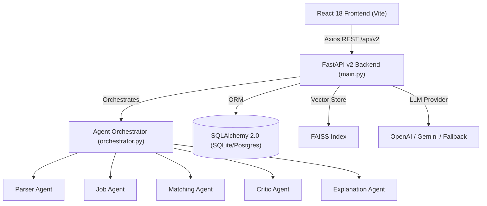

# 🔍 RESUMEIQ — REPOSITORY AUDIT REPORT

**Date:** September 6, 2026  
**Auditor:** Antigravity AI Engineering Team  
**Scope:** Complete codebase audit of ResumeIQ (`c:\Users\varav\Documents\Projects\resumeiq`)

---

## 1. Executive Summary & Architecture Overview

ResumeIQ is currently structured as a hybrid application undergoing migration from a legacy **Flask v1** backend to a **FastAPI v2** backend with a **React 18 (Vite)** single-page frontend.

### Key Architectural Characteristics
1. **Frontend:** React 18 + Vite + React Router DOM + Axios + Lucide Icons + Custom CSS (`frontend/src/`).
2. **Backend:** FastAPI 0.115.0 (`backend/main.py`) serving `/api/v2/*` endpoints. A legacy Flask app (`backend/app.py`) exists serving `/api/*` endpoints.
3. **Database:** SQLAlchemy 2.0 ORM with 10 tables defined in `backend/database/models.py`. Default database is SQLite (`resumeiq_v2.db`), with PostgreSQL support configured for production.
4. **NLP & ML:** spaCy (`en_core_web_sm`), `pdfplumber`, `python-docx`, scikit-learn (TF-IDF), `sentence-transformers` (`all-MiniLM-L6-v2`), `faiss-cpu`.
5. **AI Orchestration:** Multi-agent pipeline with 5 agents (`ParserAgent`, `JobAgent`, `MatchingAgent`, `CriticAgent`, `ExplanationAgent`). LLM support via OpenAI (`gpt-4o-mini`) and Google Gemini (`gemini-1.5-flash`) with rule-based fallback when keys are absent.

---

## 2. Feature Inventory & Component Status

| Feature / Subsystem | Existing Implementation | Quality (1-5) | Identifiable Issues & Technical Debt | Action Plan (Keep / Modify / Replace) |
|---|---|---|---|---|
| **Resume Parsing** | `backend/parser/pdf_parser.py` (pdfplumber, docx, regex taxonomy) | ⭐⭐⭐ | basic regex section splitting; lacks structured layout parsing, link extraction, metrics extraction, evidence provenance | **MODIFY**: Upgrade to structured multi-stage parser with evidence linking |
| **Skill Taxonomy** | `data/skill_ontology.json` (500 skills with alias mapping) | ⭐⭐⭐⭐ | Static JSON taxonomy; missing proficiency levels, recency, project linking, prerequisite graph | **MODIFY**: Transform into dynamic Skill Intelligence Graph & Evidence Network |
| **Multi-Agent Pipeline** | `backend/agents/` (orchestrator + 5 agents) | ⭐⭐⭐⭐ | Clean pipeline flow, but lacks Pydantic output schemas, retry loops, rate limiting, and prompt injection defense | **MODIFY**: Strengthen with typed Pydantic models, prompt defenses, and 6 new agents |
| **ATS Scoring** | `backend/parser/ats_scorer.py`, `backend/ai/xai_scorer.py` | ⭐⭐ | Single score calculation; static heuristic weights; no ATS platform profiles (Workday, Greenhouse, Lever) | **REPLACE**: Build Multi-Dimensional ATS Engine + Platform-Aware ATS Simulations |
| **Bias Detection** | `backend/ai/bias_detector.py` | ⭐⭐⭐ | Basic string matching for name/school/gender proxies | **MODIFY**: Enhance with deep equity metrics & anonymization diffs |
| **Recruiter Learning** | `backend/ai/recruiter_learning.py` | ⭐⭐⭐ | Simple JSON file memory of accept/reject decisions | **MODIFY**: Integrate into Application Success & Learning Loop |
| **Interview Coach** | `backend/ai_coach/coach.py` | ⭐⭐ | Basic static/LLM question generator; no resume claim consistency checking or project deep-dives | **REPLACE**: Build Interview Intelligence Engine & Consistency Checker |
| **Skill Gap Roadmap** | `backend/ai/gap_analyzer.py` | ⭐⭐⭐ | Static week-by-week learning plan | **MODIFY**: Build Skill ROI Engine & Career Trajectory Modeling |
| **Job Matching** | `backend/ml/recommender.py` & `matching_agent.py` | ⭐⭐⭐ | TF-IDF + Cosine Similarity against mock jobs; no real job ingestion or requirement classification | **REPLACE**: Build Job Intelligence Engine with live Source Adapters |
| **Frontend UI** | `frontend/src/` (Upload, Dashboard, Analytics) | ⭐⭐⭐ | Clean dark-mode UI with cards, but missing 7 major OS modules (Tracker, Tailoring, Cover Letter, Discovery, Portfolio, Settings) | **RE-ARCHITECT**: Upgrade to modern Career Intelligence OS UI |
| **Document Export** | None | ⭐ | No PDF/DOCX generation for tailored resumes | **NEW**: Build ATS-Safe Document Generation Engine |
| **Automated Testing** | 0 test files in repository | ⭐ | **CRITICAL DEBT**: Zero unit, integration, API, or E2E tests exist | **NEW**: Build comprehensive pytest & Vitest test suite |

---

## 3. Code Quality & Technical Debt Audit

### A. Architectural & Codebase Issues
1. **Dual Backend Engines:** Both `backend/app.py` (Flask) and `backend/main.py` (FastAPI) exist in the codebase. Flask routes (`backend/api/routes.py`) mirror FastAPI v2 routes (`backend/api/v2_routes.py`), creating code duplication and confusion.
2. **Missing Test Suite:** No `tests/` directory or test files exist anywhere in the repository.
3. **Synchronous/Asynchronous Misuse:** Several async routes in FastAPI make blocking synchronous calls to heavy CPU operations (PyTorch embeddings, spaCy NER, FAISS search) without executing them in worker threads or process pools.
4. **Lack of Input Validation Schemas:** Agent LLM outputs rely on `json.loads()` with basic dict gets rather than strict Pydantic model validation.
5. **IDOR & Authorization Vulnerabilities:** Database models use raw integer primary keys (`/api/v2/analysis/1`, `/api/v2/bias-report/1`) without user isolation or authentication middleware.

### B. AI Architecture & Prompt Safety Audit
1. **Prompt Injection Risk:** Raw resume text and job description strings are concatenated directly into LLM prompts without sanitization or boundary isolation.
2. **Deterministic vs. Generative Scoring:** In some agents, scores are generated directly by LLM text completion instead of being deterministically computed by domain algorithms.
3. **Model Abstraction:** `BaseAgent` relies on basic `openai` and `google.generativeai` direct calls instead of a clean, unified provider interface with automatic fallback cascades.

---

## 4. Security & Privacy Audit

| Security Concern | Current State | Risk Level | Remediation Plan |
|---|---|---|---|
| **Authentication & Access Control** | Token passed via parameter, no JWT or session auth | 🔴 HIGH | Implement JWT Auth + User Isolation |
| **IDOR (Insecure Direct Object Reference)** | Public integer endpoints (`/analysis/{id}`) | 🔴 HIGH | Enforce user ownership verification on all resource routes |
| **Prompt Injection** | Direct text interpolation into LLM context | 🔴 HIGH | Enforce structured XML framing & system/user boundary separation |
| **Data Retention & Privacy** | Resumes stored unencrypted on disk/database | 🟡 MEDIUM | Add AES-256 encrypted file storage & signed URL access |
| **PII in Application Logs** | Raw resume text printed in debug logs | 🟡 MEDIUM | Implement PII scrubbers in loggers |

---

## 5. Conclusion & Transition Strategy

The existing ResumeIQ repository has a **solid foundational stack** (FastAPI, React+Vite, SQLAlchemy, spaCy, sentence-transformers, FAISS). Rather than discarding the codebase, we will:
1. **Consolidate Backend on FastAPI v2**, deprecating the Flask legacy wrapper.
2. **Preserve existing database models** while adding schema migrations for new Career OS tables.
3. **Modularize the AI Services Layer** into typed, deterministic engines with LLM explanation wrappers.
4. **Build the full 5-Engine Operating System Architecture** as mandated in the mission spec.

---
